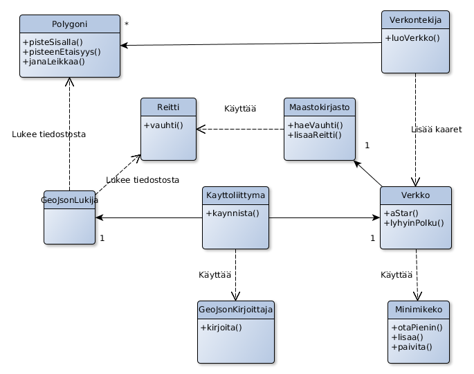

#Toteutusdokumentti reittien etsintä harjoitustyöstä.

## Ohjelman yleisrakenne:

*luokkakaavio. Vain tärkeimmät luokat merkitty*

Ohjelman toiminta jakautuu viiteen osaan:

1. Syötteenä annettujen polygonien lukeminen. 
2. Syötteenä annettujen reittien analysointi ja eri maastotyyppien vauhtien määrittely reittien pohjalta.
3. Verkon generointi polygon aineistosta, ja kaarien painotus maastotyypeille määräytyneiden vauhtien mukaan.
4. Nopeimman reitin etsintä generoidussa verkossa.
5. Etsityn reitin kirjoittaminen tiedostoon jatkokäyttöä varten.

### 1. Polygonien lukeminen
Luokka GeoJson Lukija lukee geojson muodossa tallennetut polygonit ja muodostaa niistä Polygoni luokan olioita. 
Polygoneja voi olla kahta tyyppiä: aluemaisia ja viivmaisia. AluePolygoni tarjoaa viivamaiseen Polygoni luokkaan nähden lisäksi metodin sen tarkistamiseen onko piste polygonin sisällä. Tätä tarvitaan seuraavassa vaiheessa.

### 2. Syötteenä annettujen reittien analysointi.
Luokassa Maastokirjasto pidetään kirjaa siitä minkälaista vauhtia minkäkin tyyppisen polygonin alueella pääsee kulkemaan. Lisäksi pidetään yllä ylimääräistä maastoa, joka kuvaa kaikkea sitä, mikä ei kuulu minkään polygonin vaikutuspiirin. Maastokirjasto tarjoaa metodin jolla kirjastoon voidaan lisätä reitti, ja silloin jokaisen reitin pisteen kohdalla tarkistetaan onko se aluemaisen polygonin sisällä, tai viivmaisen polygonin lähellä. Jos näin on tallennetaan pisteen ja seuraavan pisteen välillä kuljettu vauhti kirjastoon polygonin maaston mukaan. Kun kirjastosta haetaan maaston vauhtia, palauttaa se keskiarvon kaikista maastoon tallennetuista vauhdeista.

### 3. Verkon generointi
Luokka Verkontekijä vastaa verkon generoinnista. Yleisperiaate on se, että solmut muodostuvat syötteenä annettujen polygonien solmuista, ja kaaria yritetään muodostaa jokaisesta solmusta jokaiseen solmuun. Kaarta ei kuitenkaan muodosteta, jos se leikkaa jonkin polygonin reunan. Koska kaarien muodostamisyrityksiä tulisi todella paljon jaetaan polygonit naapurustoihin niiden bounding boxin keskipisteen sijainnin mukaan. Kaaria pyritään muodostamaan vain samassa naapurustossa, sekä naapurustoa ympäröivissä naapurustoissa sijaitsevien polygonien solmujen kanssa. Myöskään kaaren ja polygonin leikkausta ei tarkisteta kuin lähinaapurustoissa. Jos kaari ei leikkaa mitään polygonia lisätään se pisteiden välille. Kaaren painoksi tulee aika-arvio, eli solmujen etäisyys (m)/vauhdilla (m/s).

### 4. Nopeimman reitin etsintä verkossa
Reitin etsintä tapahtuu luokssa Verkko A* algoritmia käyttäen. A* toteutus käyttää minimikekoa ja heuristiikkafunktiona pisteen etäisyyttää maalisolmuun * minimivauhti. Verkko käyttää vieruslistoja. Päädyin tähän ratkaisuun todettuani sen huomattavasti tehokkaammaksi suorituskykytestauksessa.

### 5. Etsityn reitin kirjoittaminen tiedostoon.
Verkko tarjoaa metodin lyhyimmän reitin palauttamiseen Reitti oliona. Luokka GeoJsonKirjoittaja tarjoaa metodit reitin kirjoittamiseen geojson tiedostoon, jolloin sen jatkokäyttö esimerkiksi paikkatieto-ohjelmissa on helppoa.

##Aika ja tilavaativuudet:
Käytetään seuraavia merkintöjä:

|V|: verkon solmujen määrä.
|E|: kaarien määrä.

### Verkon generointi

### Reitin etsintää
Reitin etsintään käytetään A* algoritmia minimikeolla ja vieruslistoilla. 

Seuraavat operaatiot ovat selkeästi aikavaativuudeltaan O(1), sillä nissä ei ole mitään toistoa tai rekursiota.
* loysaa(solmu, naapuri, naapurinindeksi)
* arvio(solmu)
* minimikeon konstruktori
* minimikeon vanhempi ja lapsi operaatiot
* minimikeon vaihda(a, b) operaatio
* minimikeon tyhja() operaatio

Alustusoperaatio:

    alustus(int lahtosolmu, int maalisolmu) {
        this.maalisolmu = maalisolmu;					:vakio
        this.lahtosolmu = lahtosolmu;					:vakio
        for (int i = 0; i < this.alkuun.length; i++) {  :|V|
            this.alkuun[i] = Double.MAX_VALUE;			  :vakio
            this.polku[i] = -1;							  :vakio
            this.loppuun[i] = this.arvioiEtaisyys(i);	  :vakio

        }
        this.alkuun[lahtosolmu] = 0;					:vakio

    }
Alustuksen aikavaativuus on siis O(|V|)
    
Minimikeko heapify:

	heapify(int i) {														
        int v = this.vasenLapsi(i);											:vakio
        int o = this.oikeaLapsi(i);											:vakio
        int pienempi;														:vakio

        if (o <= this.keonKoko) {											:vakio
            if (this.arvio(this.keko[v]) < arvio(this.keko[o])) {			:vakio
                pienempi = v;												:vakio
            } else {														:vakio
                pienempi = o;												:vakio
            }

            if (arvio(this.keko[i]) > arvio(this.keko[pienempi])) {			:vakio
                this.vaihda(i, pienempi);									:vakio
                this.heapify(pienempi);										:suoritetaan enintään keon korkeuden eli log(|V|) kertaa
            }
        } else if (v == this.keonKoko && arvio(this.keko[i]) > arvio(this.keko[v])) {	:vakio
            this.vaihda(i, v);												:vakio
        }
    }
Heapifyn aikavaativuus on siis O(log|V|)

Minimikeko paivita:
	paivita(int solmu) {
        int i = this.kekoindeksit[solmu];											:vakio
        while (i > 1 && arvio(this.keko[this.vanhempi(i)]) > arvio(this.keko[i])) {	:suoritetaan enintään keon korkeuden eli log(|V|) kertaa
            this.vaihda(i, this.vanhempi(i));										:vakio
            i = this.vanhempi(i);													:vakio
        }
    }
Päivitysoperaation aikavaativuus on siis O(log|V|)

Minimikeko lisaa:
	lisaa(int solmu) {
        this.keonKoko++;														:vakio
        int i = this.keonKoko;													:vakio
        while (i > 1 && arvio(this.keko[this.vanhempi(i)]) > arvio(solmu)) {	suoritetaan enintään keon korkeuden eli log(|V|) kertaa
            this.keko[i] = keko[this.vanhempi(i)];								:vakio
            this.kekoindeksit[this.keko[i]] = i;								:vakio
            i = this.vanhempi(i);												:vakio
        }
        this.keko[i] = solmu;													:vakio
        this.kekoindeksit[solmu] = i;											:vakio

    }    

Lisäyksen aikavaativuus on siis O(log|V|). 

Minimikeko otapienin:
 	otaPienin() {

        int eka = this.keko[1];						:vakio
        this.keko[1] = this.keko[this.keonKoko];	:vakio
        this.kekoindeksit[this.keko[1]] = 1;		:vakio

        this.keonKoko--;							:vakio
        this.heapify(1);							:O(log|V|)
        return eka;									:vakio
    }
    
pienimmän ottamisen aikavaativuus on siis O(log|V|)

A*:
 	aStar() {

        MinimiKeko keko = new MinimiKeko(this.alkuun.length) { arvio() funktio}; 	:vakio

        for (int i = 0; i < this.alkuun.length; i++) {								:O(|V|)
            keko.lisaa(i);																:O(log|V|)
        }

        while (!keko.tyhja()) {														:O(|V|)
            int solmu = keko.otaPienin();												:O(log|V|)
            if (solmu == this.maalisolmu) {												:vakio
                return true;															:vakio
            }
            for (int i = 0; i < this.vl[solmu].koko(); i++) {							:O(|solmusta lähtevien kaarien määrä|) 
                int naapuri = (int) this.vl[solmu].ota(i)[0];								:vakio
                if (loysaa(solmu, naapuri, i)) {											:vakio
                    keko.paivita(naapuri);													:O(log|V|)
                }
            }
        }
        if (this.alkuun[this.maalisolmu] == Double.MAX_VALUE) {						:vakio
            return false;															:vakio
        }

        return true;																:vakio
    }

A* aikavaativuus muodostuu siis O(|V|log|V|) osasta ja O(|E|log|V|) osasta. eli kokonaisaikavaativuus on O((|V|+|E|)log|V|).

Lyhyimmän reitin palautus on aikavaativuudeltaan lineaarinen löytyneeseen reittiin nähden. Eli pahimmassa tapauksessa O(|V|) suuntaamattomassa verkossa.

**Reittien etsinnän pahimman tapauksen aikavaativuus on siis kokonaisuudessaan O((|V|+|E|)log|V|).**

## Puuteet ja parannusehdotukset:

###Puuteet
* mikäli kaksi polygonia on täysin vierekkäin voi polygonin läpi muodostua kaari jonka vauhti vastaa tuntemattoman alueen vauhtia.
* mikäli aineistossa on kovin suuria polygoneja, esimerkiksi pitkiä yhtenäisiä tiepätkiä aiheuttavat ne virheitä verkon muodostuksessa. Tämä johtuu siitä että polygonit jaetaan naapurusotihin niiden bounding boxin keskipisteen perusteella, mutta suuren polygonin vaikutus voi ulottua yli kahden naapuruston päähän.
* ohjelma ei tue viivamaisia esteitä. Esimerkiksi moottoritie tai aita on käytännössä este jota ei voi ylittää. Koska referenssireitti ei kulje myöskään estettä pitkin saa este vauhdikseen minimivauhdin (= hyvin pieni), eikä sitä pitkin silloin ehdoteta reittejä. Koska viivamaisen kohteen läpi kuljettaessa liikutaan vain yhden solmun läpi, ilman että yksikään kaari olisi viivamaisen kohteen vauhdilla, voi ohjelma ehdottaa reittiä joka kulkee esteen poikki, vaikka näin ei todillisuudessa voitaisi toimia.

###Jatkokehitettävää
* Suunnasta riippuvien maastotyyppien toteuttaminen. Reittien etsinnän osalta tämä olisi varmaankin kohtalaisen helppoa, mutta reitin analysoinnin näkökulmasta mahdollisesti haastavaa.
* Usean päällekkäisen muuttujan vaikutus vauhtiin. Yhdessä ylläolevan kanssa mahdollistaisi esimerkiksi korkeusvaihteluiden huomioonottamisen.
* Ohjelmasta voisi mahdollisesti tehdä esimerkiksi QGis pluginin, jolloin reitin analysoinnin ja reittiehdotuksen antamisen, voisi tehdä paikkatieto-ohjelman sisältä graaffisesta käyttöliittymästä.

