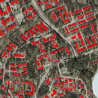

#Viikkoraportti 2

Toisen viikon aikana ohjelma on edennyt varsin mainiosti. Ohjelma on nyt sellaisessa vaiheessa, että se osaa lukea GPX tiedostosta kuljetun polun, lukea kuvasta gps pisteitä vastaavat värit ja lisätä maastokirjastoon reitin perusteella väriä vastaavan vauhdin. Tämän jälkeen ohjelma muodostaa verkon jossa jokainen kuvan pikseli vastaa yhtä solmua, ja solmut painotetaan maastokirjaston perusteella. Tämän jälkeen voidaan A* algoritmia käyttäen kysyä reittiä kuvan pisteestä toiseen ja piirtää ehdotettu reitti kuvaan.

Ohjelman käyttämistä tietorakenteista olen toteuttanut kuvaa mallintavan verkon, A*:n käyttämän minimikeon, sekä lyhyimmän polun palautuksessa käytettävän pinon. Ohjelma käyttää lisäksi javan HashMappiä maastokirjaston toteutuksessa, ja tämän oma toteutus on vielä tekemättä.

Olen kirjoittanut JUnit testejä kaikille muille luokille, paitsi GPXLukijalle ja KuvanLukijalle

Ohjelman ehdottama reitti espoon matinkylässä

Todellinen gps:llä tallennttu reitti, jonka perusteella eri värien nopeudet laskettu.

kuten yllä olevista kuvista näkyy ohjelma tällähetkellä kykenee lähinnä ehdottamaan reittiä joka ei kulje rakennuksien lävitse (käsitelty punaiseksi ennen kuvan syöttämistä ohjelmaan, jotta erottuisivat harmaasta tiestöstä). Tähän varmaankin vaikuttaa seuraavat asiat:

* en päässyt kävelemään keskellä autotietä, joten monesti latvuston alapuolella ollut jalkakäytävä näkyy kuvassa vihreän/ruskean sävyinä, mikä sekottaa maastokirjaston toimintaa.
* Jostain toistaiseksi tuntemattomasta syystä ohjelmaan ilmestyy bugeja (yritetään lukea taulukon ulkopuolelta reittiä purettaessa) kun nostan kuvan värien määrän yli 16 värin. Kun värien määrä vähennetään kuutentoista, eri maastoja saatetaan esittää samalla värillä.

A* myös hidastuu kohtuuttomasti, jos eri maastojen väliset nopeuserot kasvavat suuriksi (havaittu pirretyllä testikuvalla ja käsin luodulla maastokirjastolla). En ole vielä ymmärtänyt miksi näin käy?
* nopein reitti todellakin kulkee ainakin teoriassa pihojen poikki. Kun tallennan referenssireittiä, en kuitenkaan kävele esim. aitojen tai muiden esteiden lävitse, mutta ne eivät erotu eri värisinä kuvassa, joten ohjelma ei tiedä, että sen ehdottamalle reitille sisältyy paljon pieniä mutkia.

Seuraavaksi ajattelin tehdä oman toteutuksen hajautustaululle, testauksen GPXLukijalle ja KuvanLukijalle, sekä tutkia ohjelman toimintaa hieman lisää. Ajattelin anakin:

* kokeilla miten ohjelma toimii jos korvaan sateliittikuvan maastokartalla.
* kokeilla miten suuria kuvia ohjelma pystyy käsittelemään. (toistaiseksi olen koittanut vain 200x200px)
* kokeilla saada suurempia nopeuseroja eri maastojen väleille tallentamalla reitin fillarilla kävelyn sijaan.

Mietin myös verkon toteuttamista jotenkin muuten, kuin siten että jokainen pikseli vastaa yhtä solmua. Esim siten että etsitään kuvasta samanväriset alueet ja luodaan vain pikseleiden, joiden naapureina on muun värisiä pikseleitä välille kaaria, sillä samanvärisen alueen sisällä ei jokatapauksessa kannata tehdä mutkaa. Tämän toteuttaminen saattaa kuitenkin olla hankalaa joten ajattelin tehdä ainakin hajatustaulun toteutuksen ensin. 

Alueisiin perustuva verkko käytännössä myös tarkkoittaisi sitä että aineiston pitäisi olla voimakkaasti luokiteltua (esim maastokartta sateliittikuvan sijaan), ja herääkin kysymys onko luokitellun aineiston kanssa ylipäätänsä järkevää työskennellä rasterikuvasta käsin vai olisiko parempi ratkaisu muodostaa verkko ja maastokirjasto jotenkin muuten. Polygon muotoinen paikkatietoaineisto voisi olla vaihtoehto.

