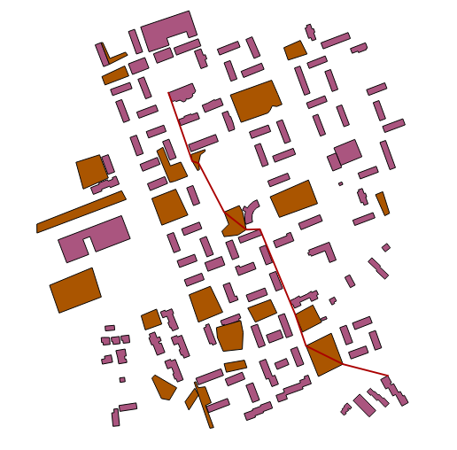

#Viikkoraportti 3

Ohjelman ehdottama reitti qgis paikkatieto-ohjelmassa, ruskeat parkkipaikkoja (nopeampi vauhti), lila rakennnuksia (vauhti = 0), ja valkoinen tuntematonta maastoa(vauhti hitaampi)

Tällä viikolla suurin muutos ohjelmassani oli, että päädyin toteuttamaan verkon muodostuksen kuvan sijaan vektorimuotoista paikkatietoaineistoa käyttäen. Syitä tähän olivat:

* Reitin etsinnän tehostaminen. Verkko muodostetaan nyt siten, että vain alueiden reunat muodostavat solmuja, ja näin verkon solmujen määrää saadaan huomattavasti vähennettyä. Toisaalta verkon muodostus on nyt raskaampaa, mutta se tarvitsee tehdä vain kerran.
* Aineiston helppo saatavuu. Aineisto on valmiiksi georeferoitua ja eri kohteiden (rakennukset, vesistöt...) lisääminen oman maun mukaan on helppoa
* Ohjelma on paljon hyödyllisempi kun se juttelee huomattavasti helpommin paikkatieto-ohjelmistojen kanssa. Esimerkiksi saadun tuloksen visualisointi on järkevämpää tehdä paikkatieto-ohjelmassa.
* koska en saanut kuvatiedoston pohjalta toimivaa algoritmia toimimaan luokittelematta kuvan pikseleitä vain muutmaan maastoluokkaan, oli luontevaa siirtyä käyttämään aineistoa, joka oli jo valmiiksi luokiteltua.

Koska muutos ohjelmaan oli varsin haasteellinen oli myös sen toteuttaminen melko työlästä ja niimpä en ole oikeastaan edennyt tällä viikolla, toisaalta ohjelmani ei enää tarvitse hajautustaulua maastokirjaston ylläpitämiseen joten säästyin sen toteuttamiselta :) 

Mitä tein tällä viikolla tarkemmin:
* Polygon luokan metodit, joilla testataan onko piste polygonin sisällä, ja leikkaako viiva polygonin.
* verkontekijä luokka, joka kontrolloi kaarien muodostamista polygonien pisteiden välille. Polygonit jaetaan naapurustoihin, ja kaaria muodostetaan naapuruston sisällä, sekä sen viereisten naapurustojen kanssa.
* GeoJson tiedoston lukeminen ja kirjoittaminen. GeoJson on standardi, jota paikkatieto-ohjelmat tukevat, joten aineiston tuottaminen ja tulosten visualisointi helpottui todella paljon
* Myös minimikeko, maastokirjasto ja itse verkko tarvitsivat muokkausta, kun verkko ei enää muodostu tasaisesti siten, että joka solmulla on 8 naapuria. Päädyin tekemään verkon vierusmatriisia käyttäen, täytyy vielä miettiä olisiko listat mahdollisesti parempi ratkaisu.
* uusien luokkien testausta(hieman kesken) ja javadoccia

Mitä seuraavaksi?
* Viivamaisten kohteiden tuki, ajattelin toteuttaa viivamaisen polygonin lisäämisen siten, että jos toteutuneen reitin piste on n etäisyyden päässä viivasta lisätään pisteen vauhti viivalle, näin esim tiestön lisääminen ilman että valmiina saatavilla olevaa aineistoa pitää suuresti muokata on mahdollista.
* koodissa on ilmeisesti vielä joitakin bugeja. Jos nähdäkseni nopein reitti kulkee polygonin ulkoreunaa pitkin ei algoritmi aina valitse sitä.
* verkontekijän testaus, ja muiden luokkien testauksen parantelua
* lista tietorakenteen toteutus
* naapurustojen optimointi, tällä hetkellä osa naapurustoista tarkistetaan kahdesti, tämä helppo korjata.
* komentorivipohjaisen käyttöliittymän toteutus.
* reitillä kuljetun ajan lisäämienn geojson tiedostoon atribuuttina.
* toteutus ja testaus dokumentaation aloittaminen

Mitä opin mm?
* geometriaan liittyviä algoritmeja! raycasting metodi sen testaamiseen onko piste polygonin sisällä ja viivojen leikkauksen testaaminen.
* luomaan json tiedostoja javalla

Mikä askarruttaa?
* miten toteutan, että voi liikkua polygonin reunaa pitkin, vaikka polygonin läpi ei saisi liikkua (esim rakennukset)? toistaiseksi olen vain testannut mihin polygoniin kaaren alku ja loppupää kuuluu ja asettanut vauhdin sen perusteella. Myöskään tällä hetkellä en ole tallettanut kaariin tietoa siitä, mihin polygoniin ne kuuluvat. (polygoneja ei oikeastaan enään ole verkon muodostamisen jälkeen)
* miten käsittelen tilanteen jossa kysytään reittiä pisteestä, joka ei ole mikään polygonin solmu. Nyt A* kutsutaan solmustä, ei koordinaateista lähtien. Ehkä tyydyttävä ratkaisu on vain etsiä lähin solmu ja lähteä siitä liikkeelle.
